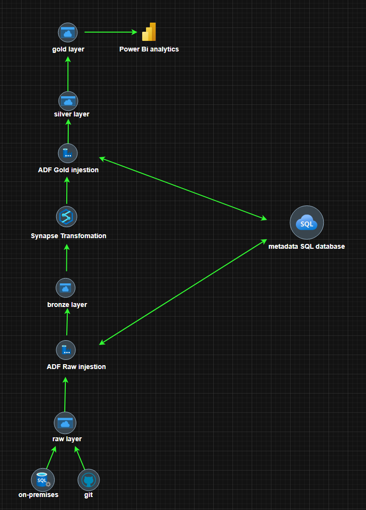
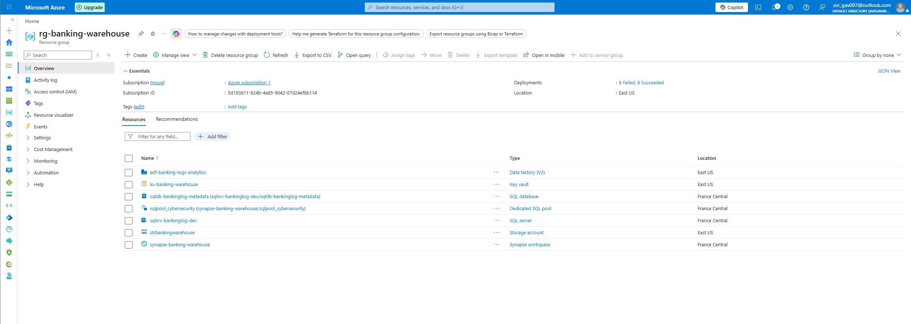
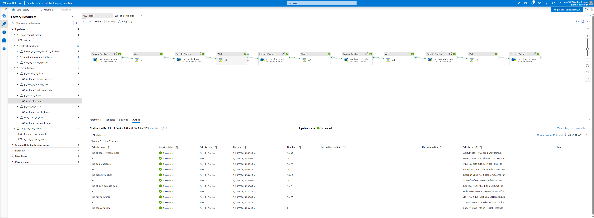
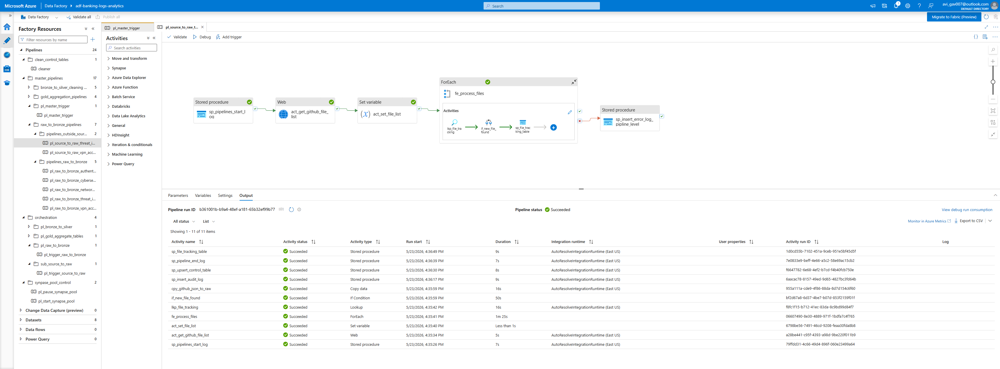
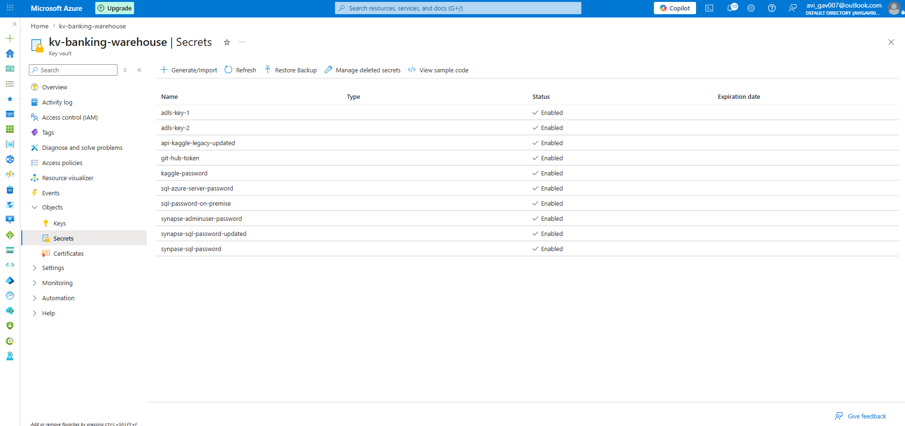
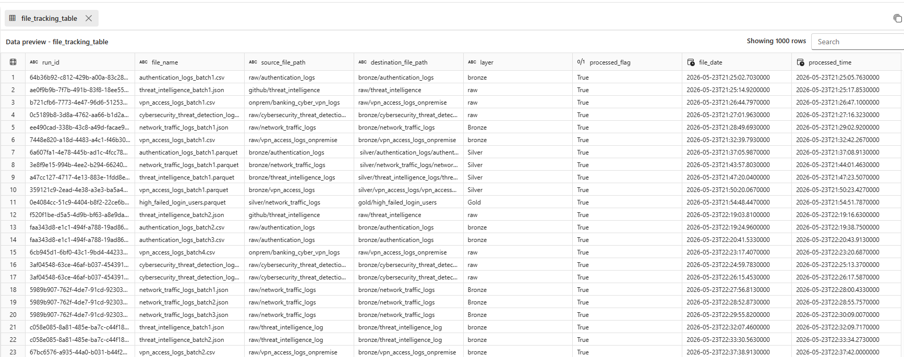
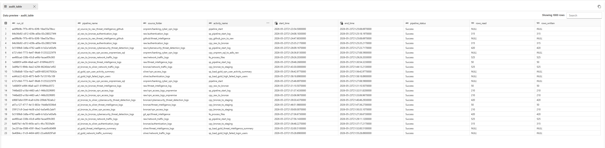

# Azure Cybersecurity Threat Detection Pipeline

Built an end-to-end Azure Cybersecurity Threat Detection Pipeline using Azure Data Factory, Synapse Analytics, ADLS Gen2, and SQL. Implemented Bronze, Silver, and Gold warehouse layers for cybersecurity log ingestion, transformation, analytics, and reporting workflows. Designed metadata-driven orchestration, incremental processing, monitoring, and secure cloud-native data engineering architecture.

---

## Project Demo Video
YouTube Demo: https://youtu.be/jlgpAMo3re8

---

## Architecture Diagram

---

## Technology Stack

- Azure Data Factory (ADF)
- Azure Synapse Analytics
- Azure Data Lake Storage Gen2
- Azure Key Vault
- SQL
- Power BI
- Delta Lake

---

# Key Features

- Metadata-driven pipeline framework
- Incremental watermark processing
- Bronze, Silver, and Gold lakehouse architecture
- Dynamic orchestration pipelines
- Centralized monitoring and logging
- Azure Key Vault secret management
- Scalable cybersecurity log processing
- Automated workflow execution

---

# Data Pipeline Flow

1. Cybersecurity source systems ingestion  
2. Azure Data Factory orchestration workflows  
3. Bronze raw data storage in ADLS Gen2  
4. Synapse transformation and cleansing workflows  
5. Silver curated processing layer  
6. Gold analytical and reporting layer  
7. Power BI dashboard reporting and analytics  

---

# Screenshots

## Azure Resource Group

---

## ADF Master Orchestration Pipeline

---

## Source to Bronze Pipeline

---

## Azure Key Vault Integration

---

## Metadata File Tracking Table

---

## Pipeline Audit Monitoring Table

---

# Enterprise Engineering Concepts Applied

- Metadata-driven orchestration
- Incremental ingestion framework
- Lakehouse architecture implementation
- Modular ETL workflow design
- Cloud-native scalability
- Centralized monitoring and governance
- Secure credential management
- Reusable pipeline framework
